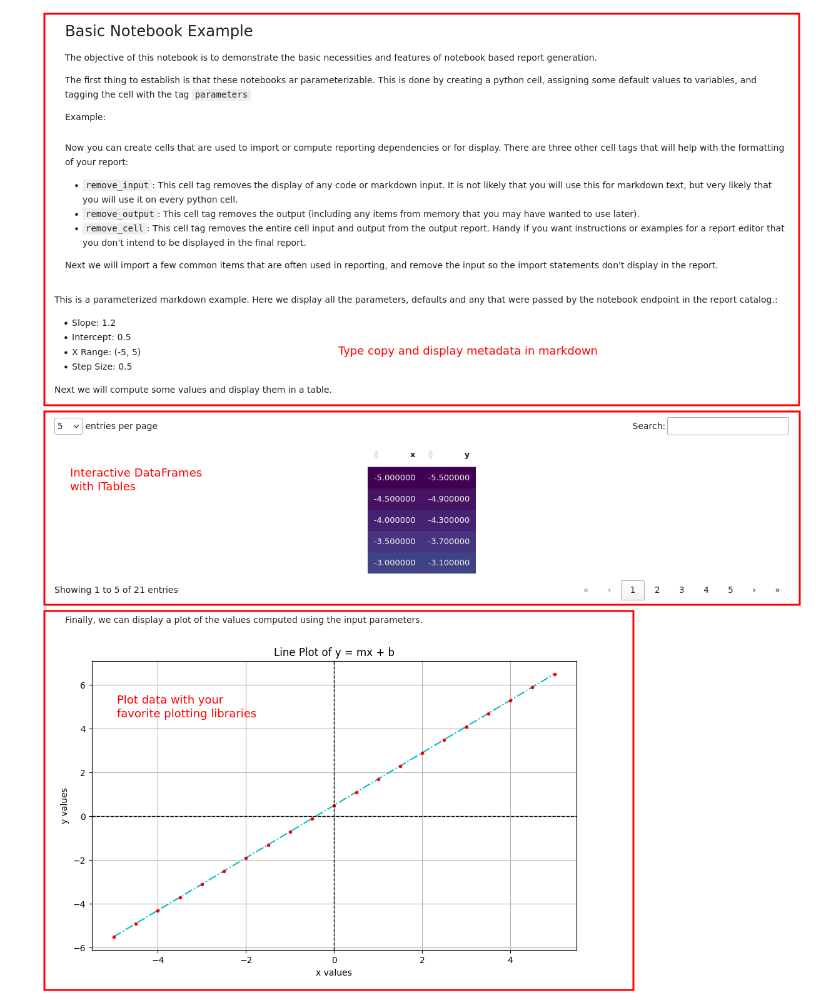

# Report Generation

The `cfa.dataops.reporting` module provides tools for generating parameterized reports from Jupyter notebooks. Reports can be exported as HTML files or uploaded directly to Azure Blob Storage.

## Getting Started

To use the reporting system:

```python
from cfa.dataops.reporting import reportcat
```

## Available Reports

Reports are organized in a namespace structure. You can explore available reports by inspecting the `reportcat` object attributes:

```python
# List example reports
reportcat.examples.basics_ipynb
reportcat.examples.dataset_report_ipynb
```

## Using Report Templates

Each report is represented by a `NotebookEndpoint` object that provides methods for:

- Getting report parameters (`get_params()`)
- Generating HTML output (`nb_to_html_str()`, `nb_to_html_file()`, `nb_to_html_blob()`)

### Example: Dataset Report

The dataset_report.ipynb template demonstrates a basic report that:

1. Takes a dataset namespace as a parameter
2. Shows dataset configuration
3. Displays available versions
4. Provides data summaries and samples
5. Creates visualizations

Example usage:

```python
# Get the report endpoint
report = reportcat.examples.dataset_report_ipynb

# View available parameters
report.print_params()

# Generate HTML report
report.nb_to_html_file(
    html_out_path="my_report.html",
    dataset_namespace="scenarios.covid19vax_trends"
)

# Or save directly to blob storage
report.nb_to_html_blob(
    blob_account="myaccount",
    blob_container="mycontainer",
    blob_path="reports/dataset_report.html",
    dataset_namespace="scenarios.covid19vax_trends"
)
```

## Creating Custom Reports

To create a new report:

1. Create a Jupyter notebook in the `cfa/dataops/reporting/reports` directory
2. Use cell tags `parameters` and `remove_input` for parameter cells
3. Add help text as comments for parameters
4. Use markdown cells for documentation
5. The report will automatically be available in the `reportcat` namespace

### Report Parameters

Parameters are defined in cells tagged with "parameters":

```python
dataset_namespace: str = "scenarios.covid19vax_trends"  # help string
```

### Template Best Practices

- Use cell tags to control input/output visibility
- Add clear markdown documentation
- Handle errors gracefully
- Include data validation
- Use consistent styling
- Test with different parameter

## Screenshot Example of a Report

Below is a screenshot for the basics report highlighting just a few of the things you can do with this reporting functionality. In addition to the myriad of jupyter compatible libraries that embed JavaScript (like ITables), authoring new functionality is also pretty simple, using `IPython.display` submodule, to author all sorts of add-ons that can be included in reports (e.g., a floating table of contents, or a temporary annotation layer).


